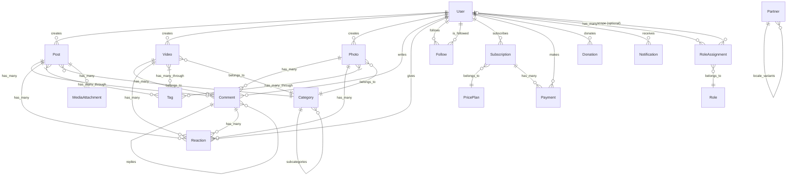

# Struktura bazy danych LibreMedia

## Przegląd

LibreMedia używa PostgreSQL 15+ jako głównej bazy danych. Wszystkie tabele używają UUID jako primary key.

---

## Diagram ERD (Entity-Relationship)



---

## Główne modele

### User (użytkownicy)

```ruby
# app/models/user.rb
class User < ApplicationRecord
  # Devise modules
  devise :database_authenticatable, :registerable,
         :recoverable, :rememberable, :validatable,
         :confirmable, :lockable, :trackable,
         :jwt_authenticatable

  # Associations
  has_many :posts
  has_many :videos
  has_many :photos
  has_many :comments
  has_many :reactions
  has_many :subscriptions
  has_many :donations
  has_many :notifications

  # Following system
  has_many :active_follows, class_name: 'Follow', foreign_key: :follower_id
  has_many :passive_follows, class_name: 'Follow', foreign_key: :followed_id
  has_many :following, through: :active_follows, source: :followed
  has_many :followers, through: :passive_follows, source: :follower
end
```

| Kolumna | Typ | Opis |
|---------|-----|------|
| `id` | uuid | Primary key |
| `email` | string | Email (unikalny) |
| `username` | string | Nazwa użytkownika (unikalna) |
| `first_name` | string | Imię |
| `last_name` | string | Nazwisko |
| `bio_i18n` | jsonb | Bio (wielojęzyczne) |
| `avatar` | string | URL avatara |
| `locale` | string | Preferowany język |
| `timezone` | string | Strefa czasowa |
| `verified_at` | datetime | Data weryfikacji |
| `created_at` | datetime | Data utworzenia |
| `status` | string | pending/active/suspended/deleted |
| `discarded_at` | datetime | Soft-delete (Discard gem) |

---

### Role (role)

System ról z hierarchią i uprawnieniami. Szczegóły: [features/users.md](features/users.md)

| Kolumna | Typ | Opis |
|---------|-----|------|
| `id` | uuid | Primary key |
| `name` | string | Nazwa wyświetlana |
| `name_i18n` | jsonb | Nazwa (wielojęzyczna) |
| `slug` | string | Unikalny identyfikator (np. `admin`) |
| `description_i18n` | jsonb | Opis (wielojęzyczny) |
| `permissions` | jsonb | Tablica uprawnień |
| `priority` | integer | Priorytet (wyższy = więcej uprawnień) |
| `system_role` | boolean | Czy rola systemowa |

**Role systemowe**: `super-admin` (100), `admin` (90), `moderator` (50), `author` (30), `user` (10), `guest` (0)

---

### RoleAssignment (przypisania ról)

Join table łącząca użytkowników z rolami. Obsługuje role globalne i kontekstualne.

| Kolumna | Typ | Opis |
|---------|-----|------|
| `id` | uuid | Primary key |
| `user_id` | uuid | FK → users |
| `role_id` | uuid | FK → roles |
| `scope_type` | string | Typ zakresu (nil = globalna) |
| `scope_id` | uuid | ID zakresu (np. właściciel bloga) |
| `granted_by_id` | uuid | FK → users (kto przyznał) |
| `expires_at` | datetime | Data wygaśnięcia |

**Unikalny indeks**: `[user_id, role_id, scope_type, scope_id]`

---

### Post (artykuły)

```ruby
# app/models/post.rb
class Post < ApplicationRecord
  include Sluggable
  include Translatable
  include Publishable
  include Reactable
  include Commentable
  include Taggable

  belongs_to :author, class_name: 'User'
  belongs_to :category, optional: true
  has_many :media_attachments, as: :attachable
end
```

| Kolumna | Typ | Opis |
|---------|-----|------|
| `id` | uuid | Primary key |
| `author_id` | uuid | FK → users |
| `category_id` | uuid | FK → categories |
| `title_i18n` | jsonb | Tytuł (wielojęzyczne) |
| `content_i18n` | jsonb | Treść (wielojęzyczne) |
| `excerpt_i18n` | jsonb | Zajawka (wielojęzyczne) |
| `slug` | string | URL slug (unikalny) |
| `status` | string | draft/published/archived |
| `visibility` | string | public/subscribers/private |
| `published_at` | datetime | Data publikacji |
| `featured` | boolean | Wyróżniony |
| `views_count` | integer | Liczba wyświetleń |

---

### Video (wideo)

```ruby
# app/models/video.rb
class Video < ApplicationRecord
  include Sluggable
  include Translatable
  include Publishable
  include Reactable
  include Commentable
  include Taggable

  belongs_to :author, class_name: 'User'
  belongs_to :category, optional: true
end
```

| Kolumna | Typ | Opis |
|---------|-----|------|
| `id` | uuid | Primary key |
| `author_id` | uuid | FK → users |
| `category_id` | uuid | FK → categories |
| `title_i18n` | jsonb | Tytuł |
| `description_i18n` | jsonb | Opis |
| `slug` | string | URL slug |
| `youtube_url` | string | Link YouTube |
| `video_file` | string | Plik wideo (upload) |
| `thumbnail` | string | Miniaturka |
| `duration_sec` | integer | Czas trwania (sekundy) |
| `status` | string | draft/published/archived |
| `visibility` | string | public/subscribers/private |

---

### Subscription (subskrypcje)

```ruby
# app/models/subscription.rb
class Subscription < ApplicationRecord
  belongs_to :user
  belongs_to :creator, class_name: 'User'
  belongs_to :price_plan, optional: true
  has_many :payments
end
```

| Kolumna | Typ | Opis |
|---------|-----|------|
| `id` | uuid | Primary key |
| `user_id` | uuid | FK → users (subskrybent) |
| `creator_id` | uuid | FK → users (twórca) |
| `price_plan_id` | uuid | FK → price_plans |
| `stripe_subscription_id` | string | ID subskrypcji Stripe |
| `status` | string | active/canceled/expired |
| `current_period_start` | datetime | Początek okresu |
| `current_period_end` | datetime | Koniec okresu |
| `canceled_at` | datetime | Data anulowania |

---

### PricePlan (plany cenowe)

| Kolumna | Typ | Opis |
|---------|-----|------|
| `id` | uuid | Primary key |
| `creator_id` | uuid | FK → users |
| `name_i18n` | jsonb | Nazwa planu |
| `description_i18n` | jsonb | Opis |
| `price_cents` | integer | Cena (w groszach) |
| `currency` | string | Waluta (PLN, USD, EUR) |
| `interval` | string | month/year |
| `stripe_price_id` | string | ID ceny Stripe |
| `active` | boolean | Czy aktywny |

---

### Donation (darowizny)

| Kolumna | Typ | Opis |
|---------|-----|------|
| `id` | uuid | Primary key |
| `donor_id` | uuid | FK → users (darczyńca) |
| `recipient_id` | uuid | FK → users (odbiorca) |
| `amount_cents` | integer | Kwota (grosze) |
| `currency` | string | Waluta |
| `message` | text | Wiadomość |
| `stripe_payment_intent_id` | string | ID płatności Stripe |
| `status` | string | pending/completed/failed |

---

### Follow (obserwacje)

| Kolumna | Typ | Opis |
|---------|-----|------|
| `id` | uuid | Primary key |
| `follower_id` | uuid | FK → users (obserwujący) |
| `followed_id` | uuid | FK → users (obserwowany) |
| `notify` | boolean | Powiadomienia włączone |
| `muted` | boolean | Wyciszony |

**Unikalny indeks**: `[follower_id, followed_id]`

---

### Reaction (reakcje)

| Kolumna | Typ | Opis |
|---------|-----|------|
| `id` | uuid | Primary key |
| `user_id` | uuid | FK → users |
| `reactable_type` | string | Polimorficzny typ |
| `reactable_id` | uuid | Polimorficzny ID |
| `reaction_type` | string | like/love/wow/sad/angry |

**Polimorficzny**: `reactable` (Post, Video, Photo, Comment)

---

### Comment (komentarze)

| Kolumna | Typ | Opis |
|---------|-----|------|
| `id` | uuid | Primary key |
| `user_id` | uuid | FK → users |
| `commentable_type` | string | Polimorficzny typ |
| `commentable_id` | uuid | Polimorficzny ID |
| `parent_id` | uuid | FK → comments (odpowiedź) |
| `content` | text | Treść komentarza |
| `status` | string | pending/approved/spam |

---

### Partner (partnerzy medialni)

| Kolumna | Typ | Opis |
|---------|-----|------|
| `id` | uuid | Primary key |
| `name` | string | Nazwa partnera |
| `slug` | string | URL slug |
| `url` | string | Link do strony/kanału |
| `description_i18n` | jsonb | Opis (wielojęzyczne) |
| `icon_class` | string | Klasa ikony Font Awesome |
| `logo` | string | Logo (upload) |
| `locale` | string | Język (pl/en/uk/nil=all) |
| `position` | integer | Kolejność wyświetlania |
| `active` | boolean | Czy aktywny |

---

### Category (kategorie)

| Kolumna | Typ | Opis |
|---------|-----|------|
| `id` | uuid | Primary key |
| `parent_id` | uuid | FK → categories (rodzic) |
| `name_i18n` | jsonb | Nazwa |
| `description_i18n` | jsonb | Opis |
| `slug` | string | URL slug |
| `position` | integer | Kolejność |
| `icon` | string | Ikona |
| `color` | string | Kolor HEX |

---

### Tag (tagi)

| Kolumna | Typ | Opis |
|---------|-----|------|
| `id` | uuid | Primary key |
| `name` | string | Nazwa tagu |
| `slug` | string | URL slug |
| `taggings_count` | integer | Counter cache |

### Tagging (powiązania tagów)

| Kolumna | Typ | Opis |
|---------|-----|------|
| `id` | uuid | Primary key |
| `tag_id` | uuid | FK → tags |
| `taggable_type` | string | Polimorficzny typ |
| `taggable_id` | uuid | Polimorficzny ID |

---

## Indeksy

### Wydajnościowe

```ruby
# Najważniejsze indeksy
add_index :posts, :author_id
add_index :posts, :category_id
add_index :posts, :slug, unique: true
add_index :posts, :status
add_index :posts, :published_at

add_index :follows, [:follower_id, :followed_id], unique: true
add_index :reactions, [:user_id, :reactable_type, :reactable_id], unique: true
add_index :subscriptions, [:user_id, :creator_id]
add_index :partners, :locale
```

### GIN (JSONB)

```ruby
add_index :posts, :title_i18n, using: :gin
add_index :posts, :content_i18n, using: :gin
add_index :users, :bio_i18n, using: :gin
```

---

## Migracje

Wszystkie migracje znajdują się w `db/migrate/`. Konwencje:

- Timestamp prefix: `YYYYMMDDHHMMSS_`
- Nazewnictwo: `create_table_name`, `add_column_to_table`
- Reversible: używaj `change` zamiast `up/down` gdzie możliwe

---

## Seeds

Dane deweloperskie w `db/seeds/development/`:

```
db/seeds/
├── development/
│   ├── 000_roles.rb
│   ├── 010_users.rb
│   ├── 020_categories.rb
│   ├── 030_tags.rb
│   ├── 040_posts.rb
│   ├── 050_partners.rb
│   └── ...
└── seeds.rb
```

Uruchomienie:
```bash
bin/rails db:seed
```

---

## Backup i recovery

### Backup

```bash
pg_dump -Fc libremedia_production > backup_$(date +%Y%m%d).dump
```

### Restore

```bash
pg_restore -d libremedia_production backup_20260201.dump
```

---

## Powiązane dokumenty

- [architecture.md](architecture.md) — Architektura systemu
- [api.md](api.md) — Dokumentacja API
